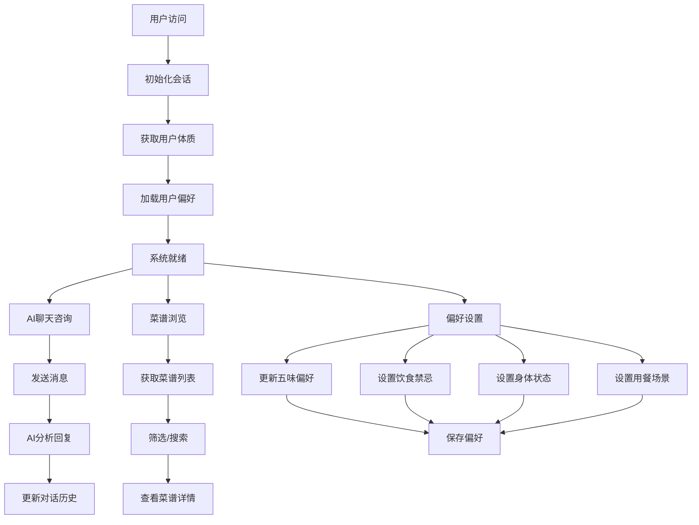

# 智膳 - 智能体质膳食推荐系统 前端开发文档

## 项目概述

智膳是一个基于中医体质理论的智能膳食推荐系统，通过 AI 分析用户体质、偏好和当前状态，为用户提供个性化的饮食建议和菜谱推荐。

### 技术栈

- **前端框架**: Vue 3 + Composition API
- **状态管理**: Pinia
- **UI 组件库**: Element Plus
- **HTTP 客户端**: Axios
- **路由管理**: Vue Router 4
- **构建工具**: Vite

## 项目结构

```
src/
├── api/                    # API接口定义
│   ├── index.js           # 主要API接口（会话、偏好、体质、菜谱）
│   ├── chat.js            # AI聊天接口
│   ├── recipe.js          # 菜谱相关接口
│   └── request.js         # Axios请求配置
├── components/            # 组件目录
│   ├── admin/            # 管理后台组件
│   ├── chat/             # 聊天相关组件
│   ├── preference/       # 偏好设置组件
│   └── recipe/           # 菜谱相关组件
├── stores/               # Pinia状态管理
│   ├── chat.js          # 聊天状态
│   ├── preference.js    # 用户偏好状态
│   ├── recipe.js        # 菜谱状态
│   └── user.js          # 用户状态
├── router/               # 路由配置
│   └── index.js         # 路由定义
├── views/                # 页面视图
├── App.vue              # 根组件
└── main.js              # 应用入口
```

## API 接口分析

### 1. 请求基础配置 (`src/api/request.js`)

**基础配置**:

- 基础 URL: `/api`
- 超时时间: 60 秒（适应 AI API 响应时间）
- 自动添加 SessionId 到请求头

**拦截器功能**:

- 请求拦截: 自动添加`X-Session-Id`头
- 响应拦截: 统一错误处理，401 时清除本地存储

### 2. 主要 API 模块 (`src/api/index.js`)

#### 2.1 会话管理 API (`sessionApi`)

```javascript
// 创建新会话
POST / api / session;

// 获取会话信息
GET / api / session / { sessionId };

// 删除会话
DELETE / api / session / { sessionId };
```

**用途**: 管理用户会话，维护用户状态和体质信息

#### 2.2 用户偏好 API (`preferenceApi`)

```javascript
// 获取用户偏好
GET / api / preferences;

// 更新用户偏好
PUT / api / preferences;

// 重置用户偏好
DELETE / api / preferences;
```

**数据结构**:

- 五味偏好: 酸、甜、苦、辣、咸
- 饮食禁忌: 素食、纯素、无麸质等
- 过敏信息
- 不喜欢食材
- 当前身体状态
- 用餐场景
- 烹饪难度和时间限制

#### 2.3 体质分析 API (`constitutionApi`)

```javascript
// 获取所有体质类型
GET / api / constitutions;

// 获取指定体质详情
GET / api / constitutions / { type };

// 设置用户体质
PUT / api / session / { sessionId } / constitution;

// 获取用户体质信息
GET / api / session / { sessionId } / constitution;
```

**体质类型**: 平和质、气虚质、阳虚质、阴虚质、痰湿质、湿热质、血瘀质、气郁质、特禀质

#### 2.4 菜谱管理 API (`recipeApi`)

```javascript
// 获取菜谱列表
GET /api/recipes?category=xx&page=1&pageSize=10&keyword=xx

// 获取菜谱详情
GET /api/recipes/{id}

// 获取推荐菜谱
GET /api/recipes/recommend?limit=6

// 获取分类统计
GET /api/recipes/categories

// 创建/更新/删除菜谱
POST /api/recipes
PUT /api/recipes/{id}
DELETE /api/recipes/{id}

// AI生成菜谱
POST /api/recipes/generate

// 保存AI生成的菜谱
POST /api/recipes/save-generated
```

### 3. AI 聊天 API (`src/api/chat.js`)

#### 3.1 普通聊天

```javascript
POST /api/chat
{
  "message": "用户消息",
  "history": [...对话历史]
}
```

#### 3.2 流式聊天

```javascript
POST /api/chat/stream
Headers: {
  "Content-Type": "application/json",
  "X-Session-Id": sessionId
}
```

**特点**: 支持 Server-Sent Events 流式响应，实时显示 AI 回复

## 状态管理分析

### 1. 用户状态 (`src/stores/user.js`)

**状态**:

- `sessionId`: 会话 ID
- `constitution`: 用户体质信息
- `constitutionInfo`: 体质详细信息
- `loading`: 加载状态
- `error`: 错误信息

**核心方法**:

- `initSession()`: 初始化会话
- `createSession()`: 创建新会话
- `setConstitution()`: 设置体质
- `clearSession()`: 清除会话

### 2. 聊天状态 (`src/stores/chat.js`)

**状态**:

- `messages`: 聊天消息列表
- `loading`: 发送状态
- `currentReply`: 当前流式回复

**核心方法**:

- `send()`: 发送普通消息
- `sendStream()`: 发送流式消息
- `clearMessages()`: 清空聊天记录

### 3. 偏好状态 (`src/stores/preference.js`)

**状态**:

- `preference`: 完整偏好配置
- `hasLoaded`: 是否已加载

**预设选项**:

- 五味标签配置
- 饮食禁忌选项（10 种）
- 身体状态选项（9 种）
- 用餐场景选项（10 种）

**核心方法**:

- `fetchPreference()`: 获取偏好
- `updateFlavorPreference()`: 更新五味偏好
- `toggleRestriction()`: 切换饮食禁忌
- `toggleCondition()`: 切换身体状态
- `toggleScenario()`: 切换用餐场景

### 4. 菜谱状态 (`src/stores/recipe.js`)

**状态**:

- `recipes`: 菜谱列表
- `currentRecipe`: 当前菜谱详情
- `categories`: 分类统计
- `pagination`: 分页信息
- `currentCategory`: 当前分类
- `searchKeyword`: 搜索关键词

**核心方法**:

- `fetchRecipes()`: 获取菜谱列表
- `fetchRecipeById()`: 获取菜谱详情
- `setCategory()`: 切换分类
- `search()`: 搜索菜谱
- `loadMore()`: 加载更多

## API 逻辑关系图



## 核心业务流程

### 1. 用户初始化流程

1. 应用启动 → 检查本地 sessionId
2. 有 sessionId → 验证会话有效性
3. 无效 sessionId → 创建新会话
4. 获取用户体质信息
5. 加载用户偏好设置

### 2. AI 聊天流程

1. 用户发送消息
2. 添加用户消息到历史记录
3. 调用 AI API（支持流式/普通）
4. 实时显示 AI 回复（流式模式）
5. 保存完整对话历史

### 3. 菜谱推荐流程

1. 基于用户体质筛选适合菜谱
2. 根据用户偏好进一步过滤
3. 考虑当前身体状态和用餐场景
4. 按相关度排序展示
5. 支持分类浏览和关键词搜索

### 4. 偏好管理流程

1. 用户调整五味偏好滑块
2. 实时本地更新（不调用 API）
3. 用户确认后批量保存
4. 支持单独修改各类设置

## 开发建议

### 1. 页面结构设计

**主要页面**:

1. **首页**: 系统介绍 + 快速入口
2. **聊天页面**: AI 营养师对话
3. **菜谱页面**: 菜谱浏览和搜索
4. **偏好设置页面**: 个人偏好配置
5. **体质测试页面**: 体质评估
6. **个人中心**: 会话管理和设置

### 2. 组件开发优先级

**高优先级**:

1. 聊天界面组件（消息列表、输入框）
2. 菜谱卡片组件
3. 偏好设置组件（五味滑块、选项卡片）
4. 体质选择组件

**中优先级**:

1. 菜谱详情组件
2. 搜索筛选组件
3. 分类导航组件
4. 加载状态组件

### 3. 状态管理最佳实践

1. **用户状态**: 全局单例，应用初始化时自动加载
2. **聊天状态**: 按会话管理，支持多会话切换
3. **偏好状态**: 实时本地更新，批量提交保存
4. **菜谱状态**: 分页加载，支持缓存

### 4. API 调用优化

1. **请求防抖**: 偏好设置滑块拖动时
2. **分页加载**: 菜谱列表支持无限滚动
3. **缓存策略**: 体质信息、分类统计等静态数据
4. **错误重试**: 网络错误时的自动重试机制

### 5. 用户体验优化

1. **加载状态**: 所有 API 调用都有 loading 状态
2. **骨架屏**: 首次加载时的占位效果
3. **离线提示**: 网络断开时的友好提示
4. **响应式设计**: 支持移动端和桌面端

## 安全考虑

1. **会话管理**: SessionId 自动过期和刷新
2. **数据验证**: 前端输入验证 + 后端验证
3. **XSS 防护**: 用户输入内容转义处理
4. **CSRF 防护**: 使用 CSRF Token

## 性能优化

1. **组件懒加载**: 按需加载页面组件
2. **图片懒加载**: 菜谱图片懒加载
3. **API 缓存**: 不常变的数据缓存
4. **代码分割**: 路由级别的代码分割

## 部署配置

1. **环境变量**: API 基础 URL 配置
2. **代理配置**: 开发环境 API 代理
3. **构建优化**: 生产环境代码压缩和优化
4. **CDN 配置**: 静态资源 CDN 加速

---

_此文档基于当前 API 接口和状态管理结构分析生成，后续开发中如有接口变更请及时更新文档。_
